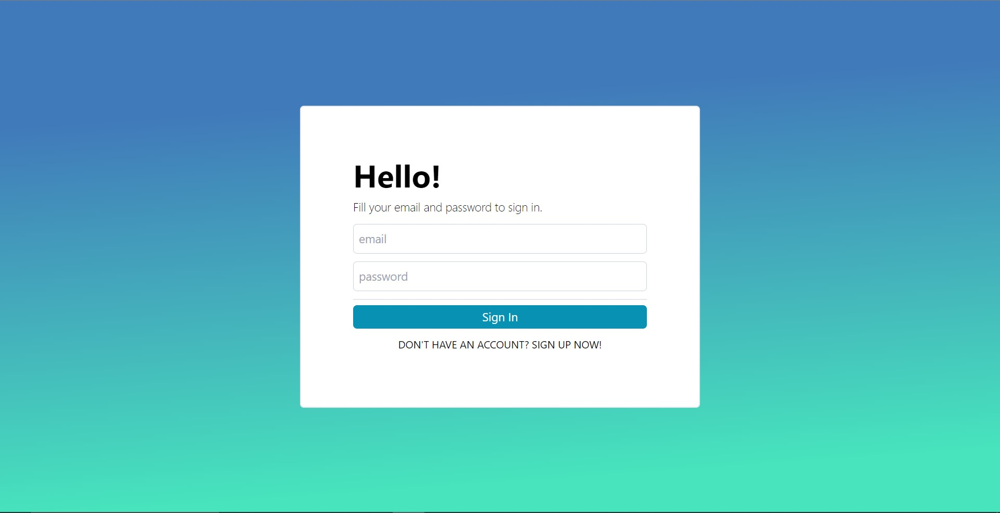
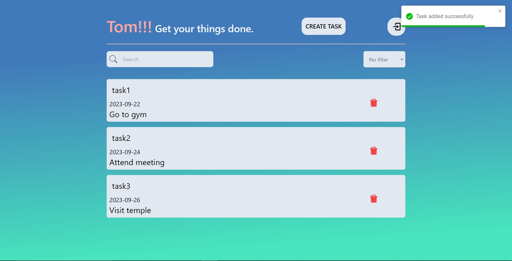
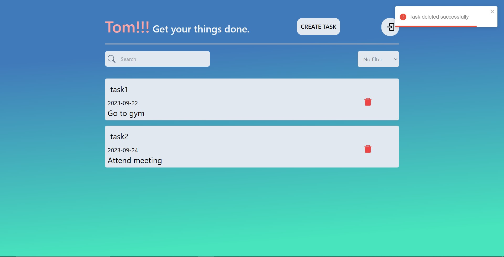
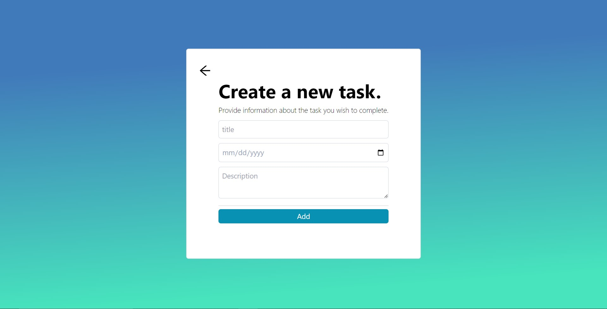

# <a href="https://to-do-tomkndn.vercel.app/"> Task Management<a/>

## What is Task Management?
- A web application that may save you from missing tasks. But this is still a simple one.
- I strongly recommend you to enhance this project if you want to use it on production or you can just refer this project.
- Below is 2 users account:

|      email      |   Password   |
|:---------------:|:------------:|
|  tom@gmail.com  |   Tom1234    | 
|  abcd@gmail.com |   abcd1234   |

`The more full feature is comming soon!`

## Technology
- Frontend
  - React - A JavaScript library for building user interfaces
  - Create React App - React starter template
  - Toastify - For toast notification
  - React-Icons - For icons
- Backend
  - Firebase - storing all information.

  ## Getting Started

>Pre-requisites: Vite requires Node.js version 14.18+, 16+. However, some templates require a higher Node.js version to work, please upgrade if your package manager warns about it.

- Clone this repository. 
- Install dependencies and run the development server with npm:
```bash
npm install (For installing react)
npm install react-icons --save (For using React Icons)
npm install --save react-toastify (For using Toast notification)
npm install firebase (For Configure Firebase to the project)
npm run dev
```
## Some preview images



